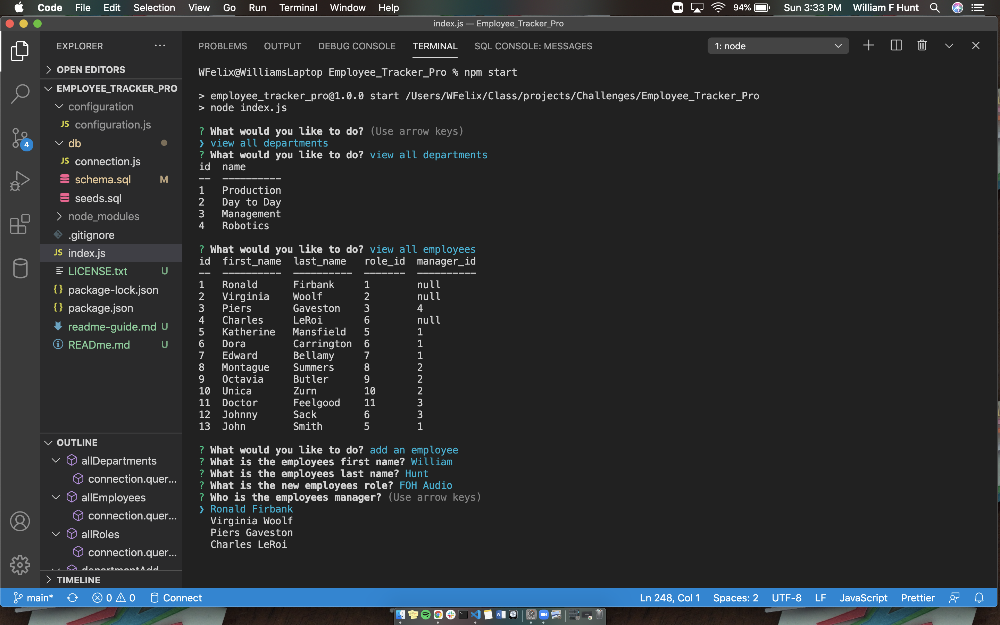

 # Employee_Tracker_Pro
   

  
  
  ### Table of Contents
  * [Description](#project-description)
  * [Installation](#installation)
  * [Usage](#usage)
  * [Contribution](#contributions)
  * [Tests](#tests)
  * [Questions](#questions)
  * [License](#license)
  
  ### Project Description
  This is a database that can be used to store employee info. There is also the ability to add new employees and more!

  ### Installation
  Star by cloning this repos main branch. Once in your command line at the root folder, run npm install. Next, you will navigate to db/connection.js and replace the "returnPassword" variable with your own MySQL password. After that all you need to do is answer the prompts to keep up with your employees!

  ### Usage
  

  ### Contributions
  Contributions are welcome!

  ### Tests
  No Tests currently

  ### Questions
  wfh2d88@gmail.com   

  https://github.com/william-hunt88

  https://github.com/william-hunt88/Employee_Tracker_Pro
  
  
  Licensed under the [MIT](https://github.com/william-hunt88/Employee_Tracker_Pro/blob/main/LICENSE.txt) license
